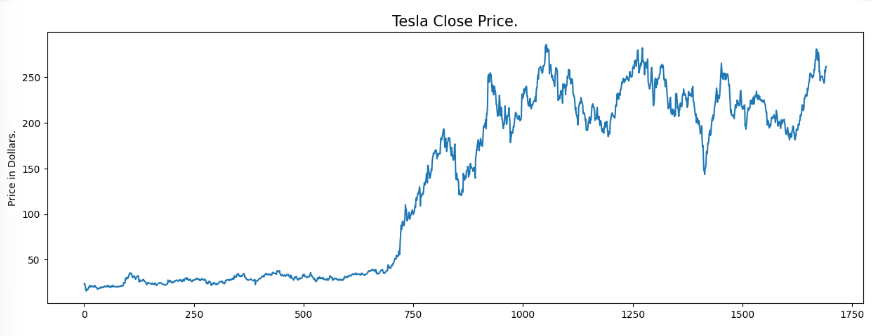
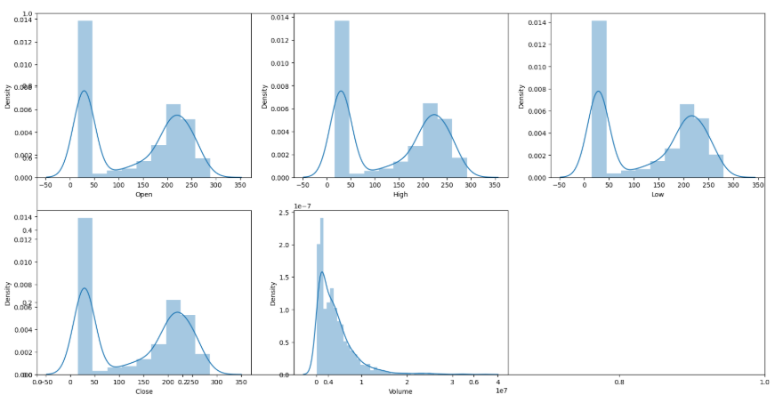
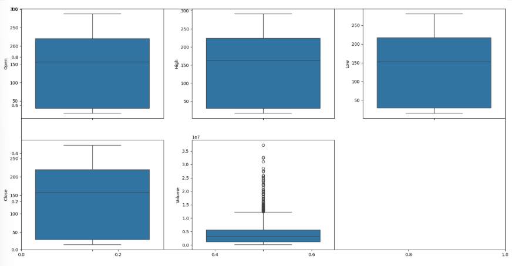
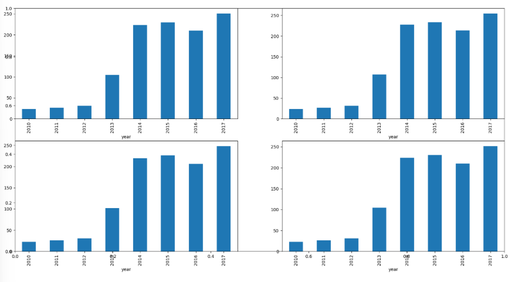
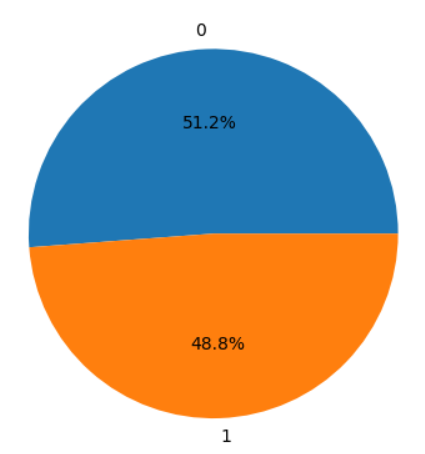
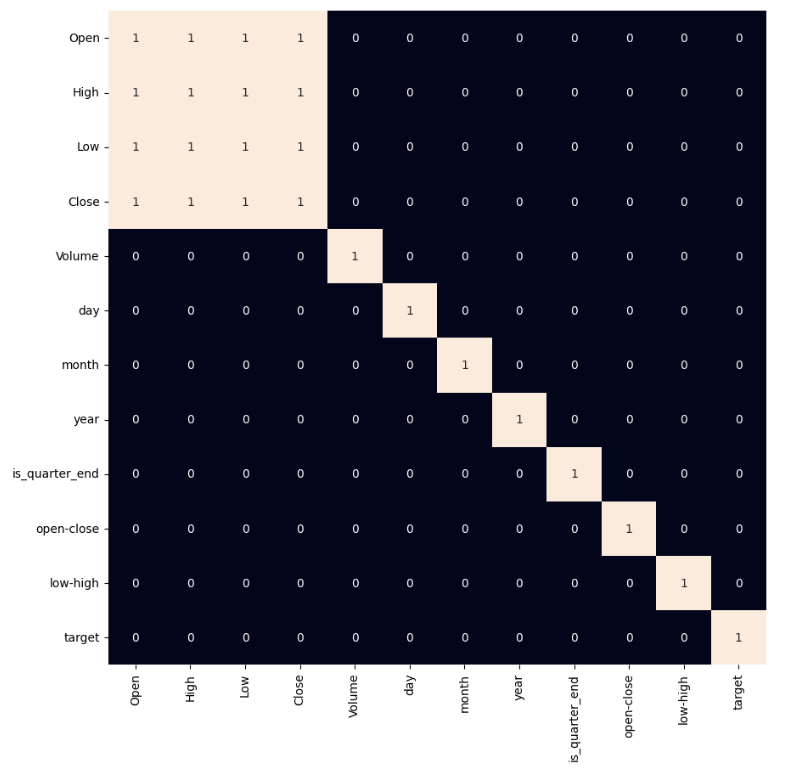
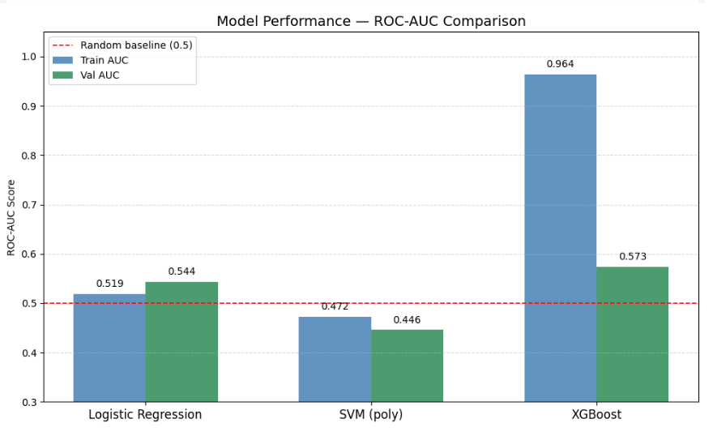
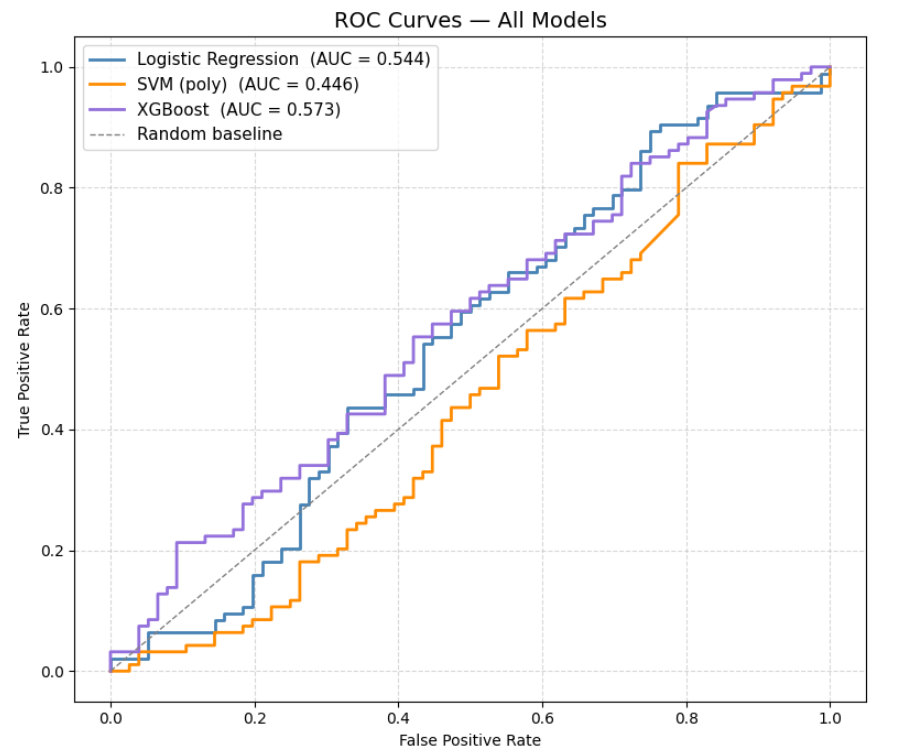
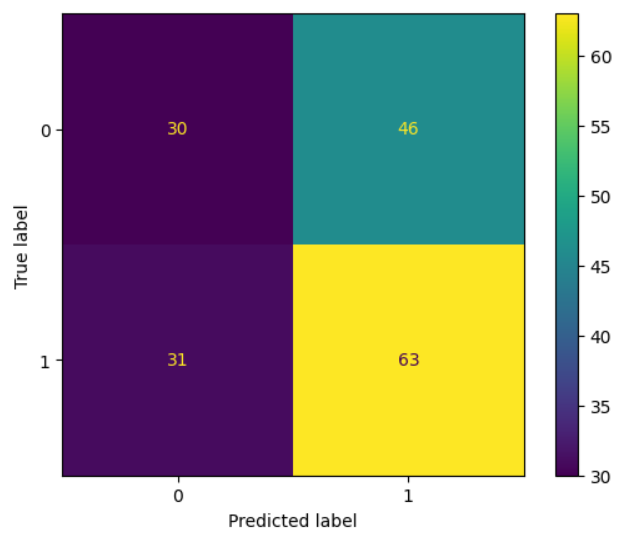

<div align="center">

# 🚗⚡ Tesla Stock Price Prediction


<br/><br/>

> **Can machine learning predict whether Tesla's stock will rise or fall tomorrow?**
> This project explores that question using 1,692 days of OHLCV data, feature engineering, and three classification models evaluated with ROC-AUC scoring.

<br/>


</div>

---

## Table of Contents

- [Overview](#-overview)
- [Dataset](#-dataset)
- [Exploratory Data Analysis](#-exploratory-data-analysis)
- [Feature Engineering](#️-feature-engineering)
- [Model Pipeline](#-model-pipeline)
- [Results](#-results)
- [Key Findings](#-key-findings)
- [Tech Stack](#️-tech-stack)
- [How to Run](#-how-to-run)
- [Project Structure](#-project-structure)
- [Future Work](#-future-work)

---

## Overview

This project builds a **binary classification model** to predict the **next-day price direction** of Tesla (TSLA) stock.

```
Input: Today's OHLCV data + engineered features
Output: 1 = Price will RISE tomorrow | 0 = Price will FALL tomorrow
```

Three models are trained and compared — **Logistic Regression**, **SVM (polynomial kernel)**, and **XGBoost** — using ROC-AUC as the evaluation metric.

---

## Dataset

| Property | Value |
|----------|-------|
| 📄 File | `Tesla.csv` |
| 📅 Period | June 2010 — 2016 (approx.) |
| 📊 Records | **1,692 trading days** |
| ❌ Missing Values | **0** |

### Columns

| Column | Type | Description |
|--------|------|-------------|
| `Date` | object | Trading date (M/D/YYYY) |
| `Open` | float64 | Opening price |
| `High` | float64 | Daily high price |
| `Low` | float64 | Daily low price |
| `Close` | float64 | Closing price |
| `Volume` | int64 | Number of shares traded |
| `Adj Close` | float64 | ⚠️ Dropped — identical to `Close` |

### Statistical Summary

| Metric | Open | High | Low | Close | Volume |
|--------|------|------|-----|-------|--------|
| **Mean** | $132.44 | $134.77 | $130.00 | $132.43 | 4,270,741 |
| **Std** | $94.31 | $95.69 | $92.86 | $94.31 | 4,295,971 |
| **Min** | $16.14 | $16.63 | $14.98 | **$15.80** | 118,500 |
| **25%** | $30.00 | $30.65 | $29.22 | $29.88 | 1,194,350 |
| **Median** | $156.33 | $162.37 | $153.15 | $158.16 | 3,180,700 |
| **75%** | $220.56 | $224.10 | $217.12 | $220.02 | 5,662,100 |
| **Max** | $287.67 | $291.42 | $280.40 | **$286.04** | 37,163,900 |

---

## 📊 Exploratory Data Analysis

### Tesla Close Price — Historical Trend



Tesla's close price shows a **strong upward trend** from ~$15 in 2010 to a peak of ~$286, with significant volatility in later years.

---

### Feature Distributions



Price features (Open, High, Low, Close) are **right-skewed**, reflecting Tesla's exponential growth phase. Volume is heavily skewed with occasional extreme spikes on high-activity trading days.

---

### Outlier Detection — Box Plots



Price columns show clean distributions with few outliers. Volume has significant upper outliers corresponding to major news events and earnings releases.

---

### Yearly Mean Prices



All four price metrics (Open, High, Low, Close) follow the same yearly trend — confirming their high correlation and justifying the use of spread-based engineered features instead.

---

### Quarter-End Effect

| Quarter-End | Mean Open | Mean Close | Mean Volume |
|-------------|-----------|------------|-------------|
| ❌ No (0) | $130.81 | $130.80 | 4,461,581 |
| ✅ Yes (1) | $135.68 | $135.67 | 3,891,084 |

> Quarter-end months show a **slightly higher mean close price** (~$5 higher) but lower volume — a mild seasonal pattern worth capturing as a feature.

---

### Target Variable Distribution



✅ **Well-balanced classes** (~51.8% rise vs ~48.2% fall) — no oversampling or undersampling required.

---

### Feature Correlation Heatmap



`Open`, `High`, `Low`, and `Close` are all **>0.99 correlated** with each other. Using them directly as model inputs would cause multicollinearity. Instead, spread-based engineered features are used.

---

## Feature Engineering

| Feature | Formula | Intuition |
|---------|---------|-----------|
| `open-close` | `Open − Close` | Intraday directional move |
| `low-high` | `Low − High` | Daily volatility range |
| `is_quarter_end` | `1 if month % 3 == 0` | Seasonal/institutional effect |

### Target Definition

```python
df['target'] = np.where(df['Close'].shift(-1) > df['Close'], 1, 0)
#                        ↑ tomorrow's close > today's close?
```

---

## Model Pipeline

```
 ┌─────────────────────────────────────────────────────┐
 │                    Tesla.csv                        │
 └───────────────────────┬─────────────────────────────┘
                         │
              ┌──────────▼──────────┐
              │   Data Cleaning     │
              │  Drop Adj Close     │
              │  Check nulls (0)    │
              └──────────┬──────────┘
                         │
              ┌──────────▼──────────┐
              │ Feature Engineering │
              │  open-close         │
              │  low-high           │
              │  is_quarter_end     │
              │  Binary target      │
              └──────────┬──────────┘
                         │
              ┌──────────▼──────────┐
              │  StandardScaler     │
              │  Train/Val Split    │
              │  90% / 10%          │
              │  (1522 / 170 rows)  │
              └──────────┬──────────┘
                         │
          ┌──────────────┼──────────────┐
          │              │              │
  ┌───────▼──────┐ ┌─────▼─────┐ ┌────▼──────────┐
  │  Logistic    │ │    SVM     │ │   XGBoost     │
  │  Regression  │ │   (poly)   │ │  Classifier   │
  └───────┬──────┘ └─────┬─────┘ └────┬──────────┘
          │              │             │
          └──────────────┼─────────────┘
                         │
              ┌──────────▼──────────┐
              │   ROC-AUC Scoring   │
              │   Confusion Matrix  │
              └─────────────────────┘
```

---

## Results

### ROC-AUC Scores

| Model | Train AUC | Val AUC | Gap | Verdict |
|-------|-----------|---------|-----|---------|
| ✅ **Logistic Regression** | 0.519 | **0.544** | 0.025 | Best generalisation |
| ❌ SVM (poly kernel) | 0.472 | 0.448 | 0.024 | Underperforms |
| ⚠️ XGBoost | **0.964** | 0.573 | 0.391 | Severe overfitting |

### Model Comparison Chart



### ROC Curves



### Confusion Matrix — Logistic Regression



---

## Key Findings

> ### 1. 🟢 Logistic Regression — Best Baseline
> Closest train/val AUC gap (0.025). With limited engineered features, it generalises most reliably and is the most interpretable model.

> ### 2. 🔴 XGBoost — Overfitting Alert
> Training AUC of **0.964** vs validation AUC of **0.573** — a gap of 0.391. The model memorises training data with only 3 input features. Requires regularisation or more features.

> ### 3. 🟡 SVM — Not Suitable
> Polynomial kernel fails to find a useful decision boundary even on training data. AUC below 0.5 on validation indicates predictions worse than random.

> ### 4. 📉 Feature Limitation
> Only 3 features were used as inputs. Stock prediction benefits from richer signals — technical indicators (RSI, MACD), volume trends, and lagged returns would meaningfully improve all models.

---

## Tech Stack

<div align="center">

| Library | Version | Purpose |
|---------|---------|---------|
|  | 3.8+ | Core language |
|  | latest | Data manipulation |
|  | latest | Numerical ops |
|  | latest | Plotting |
|  | latest | Statistical charts |
|  | latest | ML models & metrics |
|  | latest | Gradient boosting |

</div>

---

## How to Run

### Prerequisites
- Python 3.8+
- Jupyter Notebook or Google Colab

### Step 1 — Clone the repository
```bash
git clone https://github.com/your-username/tesla-stock-prediction.git
cd tesla-stock-prediction
```

### Step 2 — Install dependencies
```bash
pip install -r requirements.txt
```

### Step 3 — Add the dataset
```
Place Tesla.csv in the root of the project directory.
```

### Step 4 — Launch the notebook
```bash
jupyter notebook Tesla_Stock_Prediction.ipynb
```

Or open directly in **Google Colab** and mount your Drive:
```python
from google.colab import drive
drive.mount('/content/drive')
```

---

## Project Structure

```
tesla-stock-prediction/
│
├── 📓 Tesla_Stock_Prediction.ipynb   ← Main notebook
├── 📊 Tesla.csv                      ← Raw dataset
├── 📄 README.md                      ← You are here
└── 📁 images/
    ├── 01_close_price.png
    ├── 02_distributions.png
    ├── 03_boxplots.png
    ├── 04_yearly_mean.png
    ├── 05_target_distribution.png
    ├── 06_correlation_heatmap.png
    ├── 07_model_comparison.png
    ├── 08_confusion_matrix.png
    └── 09_roc_curves.png
```

---

## Future Work

- [ ] 📐 Add technical indicators — RSI, MACD, Bollinger Bands, EMA
- [ ] ⏮️ Include lagged features — yesterday's return, 5-day momentum
- [ ] 🔧 Tune XGBoost — `max_depth`, `learning_rate`, `n_estimators`, `reg_lambda`
- [ ] 🔁 Walk-forward cross-validation instead of static 90/10 split
- [ ] 🧠 Try LSTM / GRU for sequential pattern learning
- [ ] 📰 Incorporate sentiment features from news or Twitter/X
- [ ] 📦 Deploy as a live prediction dashboard (Streamlit / Gradio)

---

## License

```
MIT License — feel free to use, modify, and distribute with attribution.
```

---

<div align="center">

**Made with ❤️ using Python & Machine Learning**

⭐ *If you found this useful, consider giving the repo a star!* ⭐

</div>
